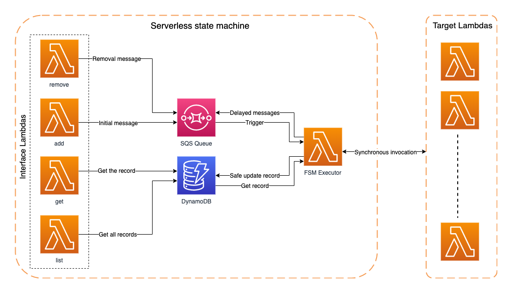

# Serverless Statemachine

This AWS Sample contains source code and tests for a barebone serverless statemachine that you can deploy with the SAM CLI. The content is structured in the following manner.

- main - This folder contains the SAM project for the actual serverless state machine.
- test/lambdas - This folder contains a bunch of test lambdas that can be used for functional test.
- test/scripts - This folder has python scripts to test the state machine.

## Architecture
This AWS sample uses a completely serverless architecture and uses only SQS, Lambda and DynamoDB to implement the finite state machine. The exact mechanism by which the interface lambdas are invoked is not in scope. This AWS sample uses boto3 SDK to invoke the lambdas directly for testing purpose. A real life usecase would mostly have them invoked through AWS API gateway instead.



## Prerequisites
- An Ubuntu linux development machine.
- An AWS account with a user having admin rights

## Notice
Deploying this AWS Sample will spin up resources in your AWS account and will result in  charges according to published pricing. 

## Setup instructions
```
# Prepapre the development machine
sudo apt update
sudo apt upgrade -y

sudo apt install python3 -y
sudo apt install python3-pip -y
pip3 --version

sudo apt install virtualenv -y
virtualenv ~/.venv -p /usr/bin/python3

sudo passwd ubuntu
/bin/bash -c "$(curl -fsSL https://raw.githubusercontent.com/Homebrew/install/master/install.sh)"

test -d ~/.linuxbrew && eval $(~/.linuxbrew/bin/brew shellenv)
test -d /home/linuxbrew/.linuxbrew && eval $(/home/linuxbrew/.linuxbrew/bin/brew shellenv)
test -r ~/.bash_profile && echo "eval \$($(brew --prefix)/bin/brew shellenv)" >>~/.bash_profile
echo "eval \$($(brew --prefix)/bin/brew shellenv)" >>~/.profile

brew tap aws/tap
brew install aws-sam-cli
sam --version # Run brew install aws-sam-cli again if the sam --version command fails.

sudo apt remove docker docker-engine docker.io
sudo apt install docker.io -y
sudo systemctl start docker
sudo systemctl enable docker

sudo groupadd docker
sudo usermod -aG docker $USER
newgrp docker
docker ps

curl -sL https://deb.nodesource.com/setup_15.x | sudo -E bash -
sudo apt-get install -y nodejs

sudo npm install -g aws-cdk

curl "https://awscli.amazonaws.com/awscli-exe-linux-x86_64.zip" -o "awscliv2.zip"
unzip awscliv2.zip
sudo ./aws/install

# Setup credentials
aws configure

# Clone the serverless-statemachine repo.
git clone https://github.com/aws-samples/serverless-statemachine.git

# Deploy the state machine.
cd serverless-statemachine/main
sam build -u
sam deploy # Use --guided option for the first time deploy
# Note down the API endpoint.

# Deploy the test lambdas
cd serverless-statemachine/test/lambdas
sam build -u
sam deploy # Use --guided option for the first time deploy. Also give a different stack name.
# Note down the lambda ARNs

# Test using the python scripts
cd serverless-statemachine/test/scripts
source ~/.venv/bin/activate
pip install boto3

# To add a new state machine
# Update the state machine configuration in serverless-statemachine/test/scripts/config/fms.json file using the Lambda ARNs obtained while deploying the test lambdas.
python add.py <ARN of ApiAddFunction noted down from the FSM deployment>

# To list all alive state machines
python add.py <ARN of ApiListFunction noted down from the FSM deployment>

# To get a given state machines
python add.py <ARN of ApiGetFunction noted down from the FSM deployment> <ID of the state machine>

# To delete a given state machines
python add.py <ARN of ApiDeleteFunction noted down from the FSM deployment> <ID of the state machine>
```

Any number of state machines can be alive simultaneously. Deletion is not immediate, rather gets synchronized with the upcoming state change for the state machine in order to prevent clean up issues. It is always recommended to exit gracefully as demonstrated in the 'finalize' lambda though.

## Clean up
Once you're done, you can delete the solution going to the AWS CloudFormation console and deleting the stacks. Don't forget to delete the CloudWatch log groups for the Lambda functions too.

## Security
See [CONTRIBUTING](CONTRIBUTING.md) for more information.

## License
This library is licensed under the MIT-0 License. See the [LICENSE](LICENSE) file.